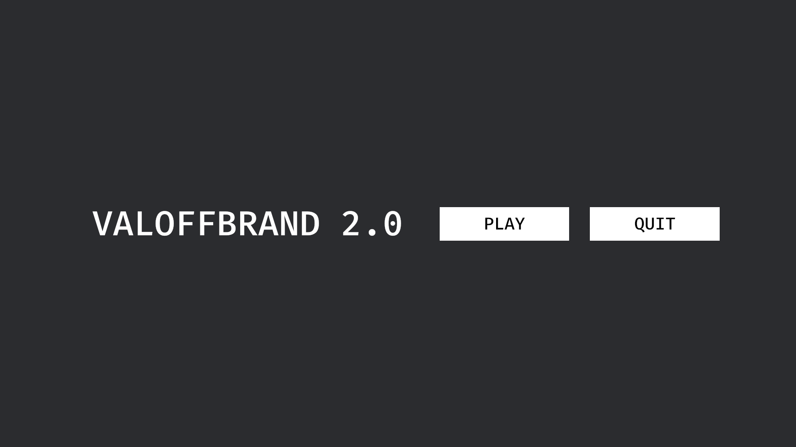

# VALOFF_BRAND 2.0
## Présentation du sujet

Objectif: Réaliser un FPS multi-joueurs local, en 3D, en utilisant le moteur Bevy


Fonctionnalités minimales attendues:

- Affichage d'une map en 3D => réalisé
- Déplacement sur la map => réalisé
- Gestion du tir et des points de vie => non réalisé
- Gestion de la mort et du respawn => non réalisé

## Instruction d'installation et d'utilisation
- Les prérequis pour lancer l'application sont d'avoir installé Rust et Cargo. Pour cela vous pouvez suivre les instructions sur le site officiel de Rust : https://www.rust-lang.org/tools/install
```
cargo build
cargo run
```
## Ressources
- [Bevy Cheat Code](https://bevyengine.org/learn/book/getting-started/setup/) (Guide d'utilisation de Bevy)
- [Bevy Components Addon](https://github.com/kaosat-dev/Blender_bevy_components_workflow/releases?q=bevy_components&expanded=true) (Pour générer les collisions et les textures sur Blender)
- [Belly](https://github.com/jkb0o/belly) (Pour l'interface et les menus graphiques) 
## Voici des screen du jeu :
### Menu principal :

### Gameplay :
